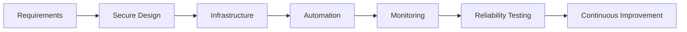

<div align="center">


<a href="https://github.com/liamLIAM99">
  
</a>

<p>
  
  
  
</p>

<p>
  <a href="https://github.com/liamLIAM99">
    
  </a>
  
</p>

</div>

---

## About Me

I'm **William Ibanez**, an **AWS Engineer** focused on building reliable, secure, and maintainable cloud infrastructure.

My work and projects combine **AWS cloud services, Linux administration, storage systems, infrastructure fundamentals, and automation**. I enjoy understanding how systems behave under failure—not only how to deploy them when everything is working.

- **Cloud:** AWS infrastructure, object storage, availability, and operational reliability
- **Systems:** Linux administration, storage, redundancy, and distributed systems
- **Engineering:** automation, troubleshooting, observability, and infrastructure documentation
- **Current focus:** strengthening production-ready AWS architecture and Infrastructure as Code practices
- **Open to:** AWS, cloud engineering, infrastructure, DevOps, and platform engineering opportunities

---

## AWS & Cloud

<p>
  
  
  
  
  
  
</p>

### Engineering principles

```text
Security first        -> least privilege, controlled access, no secrets in code
Reliability           -> redundancy, recovery, failure testing, monitoring
Automation            -> repeatable infrastructure and operational workflows
Observability         -> useful logs, metrics, alerts, and troubleshooting signals
Maintainability       -> clear architecture, documentation, and simple solutions
```

---

## Technical Stack

| Area | Technologies |
|---|---|
| **Cloud** | AWS, Amazon S3, EC2, IAM, VPC, CloudWatch |
| **Infrastructure** | Linux, Ubuntu, Virtual Machines, distributed storage |
| **Storage & HA** | S3, RAID 1, GlusterFS, replication, fault tolerance |
| **Programming** | Python, Bash |
| **DevOps & Tools** | Git, GitHub, CLI tooling, infrastructure documentation |
| **Architecture** | Cloud fundamentals, high availability, resilience, least-privilege design |

<p>
  
</p>

---

## Featured Projects

<table>
<tr>
<td width="50%" valign="top">

### Amazon S3 Projects

Hands-on repositories focused on **Amazon S3** and cloud object-storage fundamentals.

**What they demonstrate**
- AWS storage experimentation
- S3-focused cloud practice
- Git-based infrastructure learning

**Repositories**

[`amazons3bucket`](https://github.com/liamLIAM99/amazons3bucket) ·
[`s3bucket-new`](https://github.com/liamLIAM99/s3bucket-new) ·
[`s3new`](https://github.com/liamLIAM99/s3new)

</td>
<td width="50%" valign="top">

### RAID 1 on Linux

A practical **RAID 1** lab using `mdadm` on Ubuntu, including disk-failure simulation and recovery.

**What it demonstrates**
- Storage redundancy
- Linux systems administration
- Failure testing
- Data availability and recovery

[View repository →](https://github.com/liamLIAM99/raid_1_Ibanez_baseakali)

</td>
</tr>

<tr>
<td width="50%" valign="top">

### GlusterFS Distributed Storage

A two-node **GlusterFS** replicated-volume lab covering peer setup, volume creation, mounting, CRUD operations, and node-failure testing.

**What it demonstrates**
- Distributed storage
- Replication
- Linux networking
- High-availability concepts
- Service recovery testing

[View repository →](https://github.com/liamLIAM99/Gluster_ibanez_basea)

</td>
<td width="50%" valign="top">

### Disk Scheduling Algorithms

A Python implementation comparing **FCFS, SSTF, SCAN, C-SCAN, LOOK, and C-LOOK** disk-scheduling algorithms.

**What it demonstrates**
- Python fundamentals
- Operating-system concepts
- Algorithm comparison
- Storage-system fundamentals

[View repository →](https://github.com/liamLIAM99/Disk-Scheduling)

</td>
</tr>
</table>

---

## Cloud Architecture Mindset



I approach infrastructure as a system that should be **secure by default, observable in production, recoverable during failure, and repeatable through automation**.

---

## GitHub Activity

<div align="center">


</div>

---

## Current Direction

I'm continuing to deepen my AWS engineering skills around:

- **Infrastructure as Code** and repeatable deployments
- **IAM and least-privilege security**
- **VPC architecture and network isolation**
- **Monitoring and operational visibility**
- **Highly available and fault-tolerant systems**
- **Backup, recovery, and storage architecture**
- **Cloud automation and deployment workflows**

---

## Connect

<div align="center">

<a href="https://github.com/liamLIAM99">
  
</a>

<br/><br/>

**AWS Engineer · Cloud Infrastructure · Linux · Automation · Reliability**


</div>
